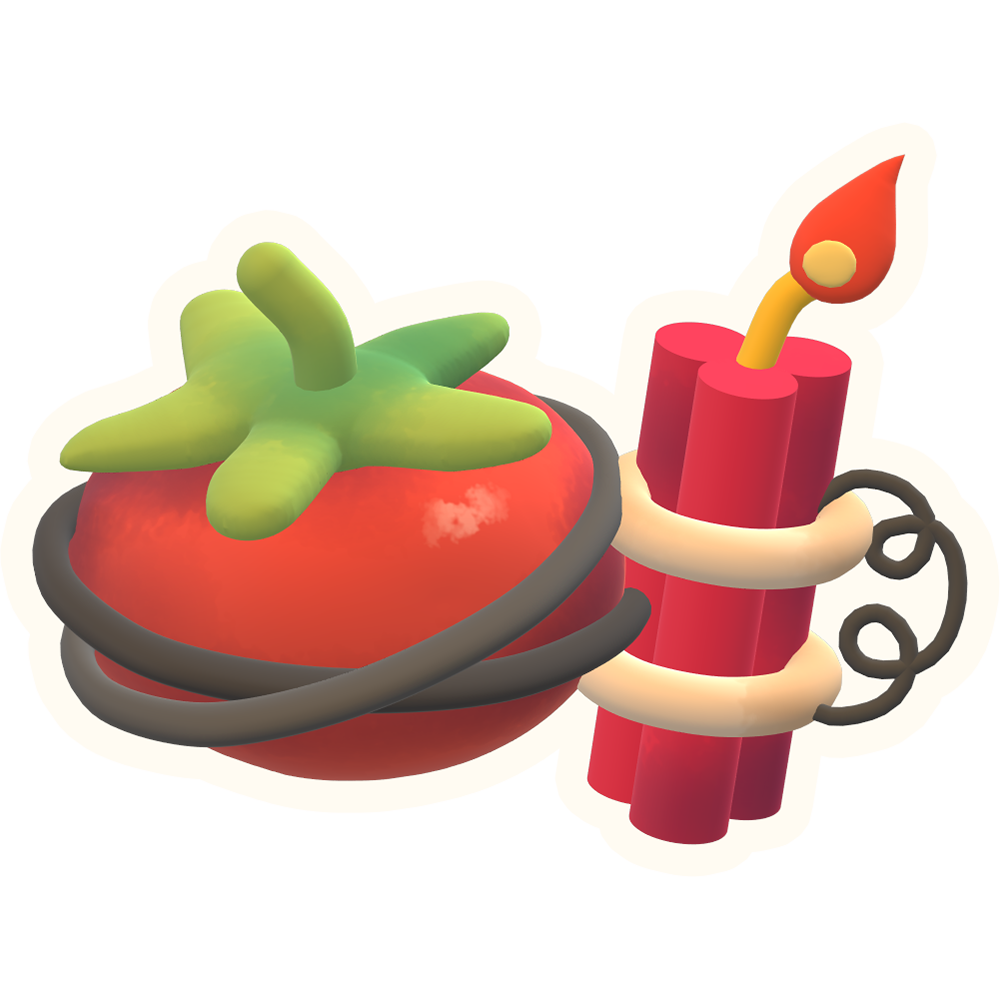

# BOMBodoro! 🍅💣 (Pomodoro Timer)

An EXPLOSIVE Pomodoro timer built right into Godot!

[Godot Asset Library](https://godotengine.org/asset-library/asset/4187)

Featuring audio by James Currier and art by Pearl Slayton!

## ⚙️ Installation

1. Search up "BOMBodoro" in the AssetLib tab in the Godot project you intend to install the plugin into.
2. Click on BOMBodoro, and press "Download". Once another window pops up, press "Install".
3. In the File Menu, navigate to "Projects" > "Projects Settings" and click on the "Plugins" tab.
4. Enable the checkbox next to the BOMBodoro plugin. The BOMBodoro window should appear docked in your editor.
5. Get timing!!!

## ⚖️ License

Bombodoro is licensed under The MIT License, and is completely free of charge. Do whatever you want with it!

The timer features the fonts [Press Start 2P](https://fonts.google.com/specimen/Press+Start+2P) and [Sour Gummy](https://fonts.google.com/specimen/Sour+Gummy). Their license is found alongside the font files in the fonts folder.

## 🙋‍♀️ Support

If you encounter any issues or have questions, feel free to [submit an issue](https://github.com/yukonmakesgames/bombodoro/issues)!

Made with 💖 by [Yukon](https://yukonmakes.games).
